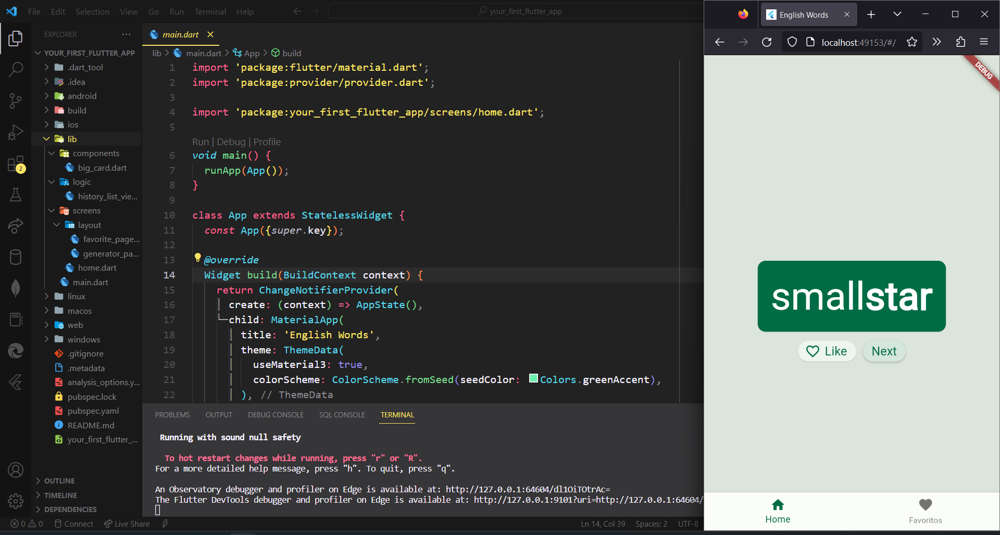
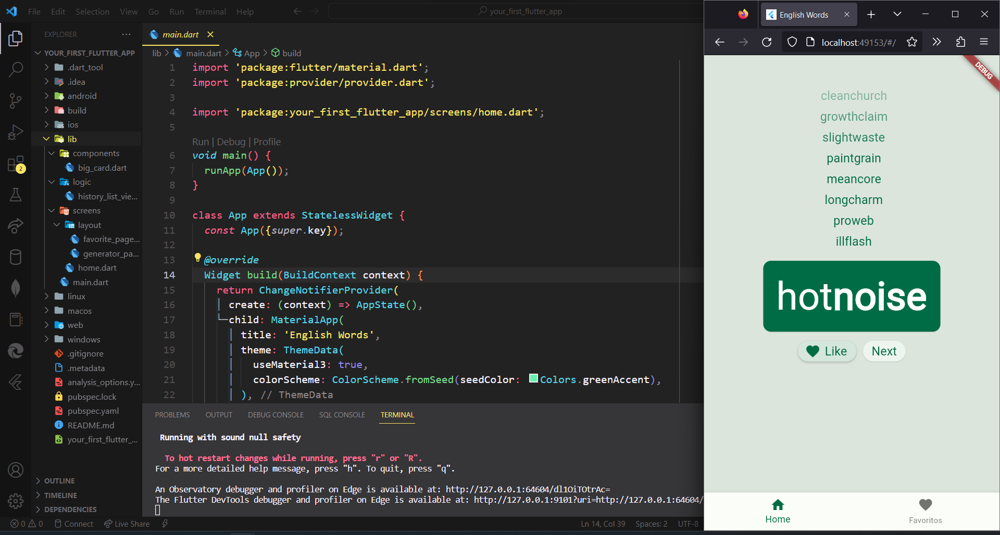
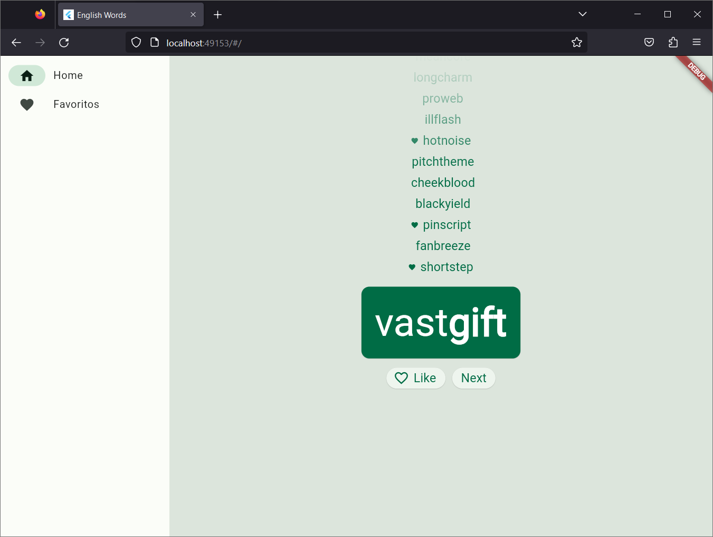
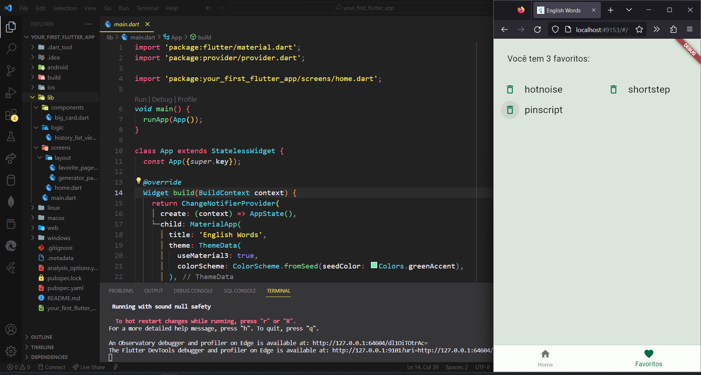

# English-Words

## Sobre
English Words, um projeto que consome um package do https://pub.dev/ (english_words: ^4.0.0) que contém mais de 5000 palavras em inglês para mostrar aleatoriamente na tela e com o usuário tendo poder de escolha de dar um like ou passar para a próxima palavra, todas as palavras favoritadas são salvas em state no aplicativo e salvadas na página de favoritos. Vários conceitos abordados esse projeto, como: **O essencial de como o Flutter funciona**, **Criando e componentizando layouts**, **Manuseando interações do usuário**, **Design responsivo**, **Animações básicas (ShaderMask, AnimatedList, Gradients, SizeTransition)**, **Utilizando states globais (ChangeNotifier)**, **Noções de aessibilidade** etc. Referência: https://codelabs.developers.google.com/codelabs/flutter-codelab-first#0 

### Conteúdos  
* [Sobre](#sobre)  
* [Tecnologias](#tecnologias)  
* [Quick Start](#quick-start)  
* [File Tree](#file-tree)  
* [Screenshots](#screenshots) 

## Tecnologias
* Flutter
* Dart

## Quick Start
**Visualizar e Modificar**
* Baixar o repositório
* Descompactar a pasta
* Certifique-se que tenha uma versão do Flutter instalada, caso não tenha: https://docs.flutter.dev/get-started/install
* Adicione o Flutter bin para o Path (váriaveis de ambiente)
* Com a pasta do projeto aberta em algum editor de código, digite no terminal `flutter run`
* Todo o meu código está dentro da pasta `lib`, note que todo aplicativo flutter tem uma função principal `main.dart`, que é o ponto de partida de um aplicativo flutter

## File Tree
```
.
└── lib/
    ├── components/
    │   └── big_card.dart
    ├── login/
    │   └── history_list_view.dart
    ├── screens/
    │   ├── layout/
    │   │   ├── favorite_page.dart
    │   │   └── generator_page.dart
    │   └── home.dart
    └── main.dart
```

## Screenshots




